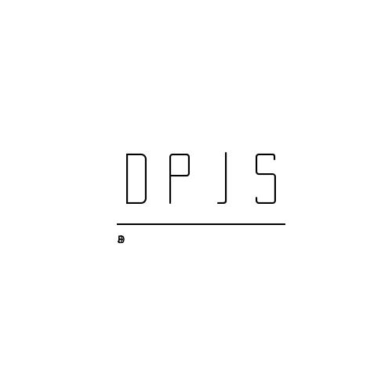

# uni-draw-poster 绘制海报工具

创建绘制海报canvas矩形方法，内置了图片绘制，圆角矩形绘制，换行字体绘制等方法。拥有良好的语法架构，不会在绘制`uni/wx`矩形时陷入回调地狱。支持原生小程序，与`uniapp`多端应用。当是原生小程序时，自动切换为性能更好的`type2d`绘制方式。让你只需考虑业务逻辑，而不用考虑其他事情。

**npm 安装插件**

~~~
npm i --save-dev uni-draw-poster
~~~

**开启对该插件的uni条件编译（重要）**

~~~js
// vue.config.js
module.exports = {
  transpileDependencies: ['uni-draw-poster'],
};
~~~

## 1. 创建生成海报绘制工具

~~~html
<canvas id="canvas" style="width:100rpx;height:100rpx" type="2d" />
~~~

~~~js
import DrawPoster from 'uni-draw-poster'
async onReady() {
 // 传入选择器, 初始化绘制工具(注意, 不需要传入#符号) 当微信小程序时, 将自动启用type2d绘制
 const dp = await DrawPoster.build("canvas")   
}
~~~

## 2. 设置画布尺寸
~~~js
// 设置长高为100px的矩形宽高
dp.canvas.width = 100
dp.canvas.height = 100
~~~

## 3. 绘制任意内容
~~~js
dp.draw(async (ctx) => {
    // 绘制背景颜色
    ctx.fillStyle = "#F4F4F4";
    ctx.fillRect(0, 0, dp.node.width, dp.node.height);
    // 绘制字体
    ctx.textBaseline = "top";
    ctx.textAlign = "start";
    ctx.fillStyle = "white";
    ctx.font = `bold ${22}px sans-serif`;
    ctx.fillText('周先生', dp.node.width/2, 38.5);
})
~~~
值得注意的是, `draw`方法会自动的执行`ctx.save/ctx.restore`, 不需要人为操纵绘画栈.
~~~js
dp.draw(async (ctx) => {/* ... */})
// 相当于
ctx.save()
/* ... */
ctx.restore()
~~~
## 4. 进行绘制

`dp.draw`并不会马上绘制，只是将该任务添加到了任务栈，需要使用`dp.awaitCreate`函数进行绘制，该函数在绘制完毕后将弹出所有任务。
`dp.awaitCreate`在非`2d`绘画中，执行绘画任务完毕后，将自动执行`ctx.draw`方法，并在draw绘画才算异步结束。

~~~js
dp.draw(async (ctx) => {/* ... */})
// 由于每个任务都有可能会有异步的绘制任务, 所以得需要使用await等待绘制
const result = await dp.awaitCreate();
// 绘制成功将返回每个任务的绘制状况组成的数组
console.log("draw绘制状况:", result); // draw绘制状况: [true]
~~~

[^为什么这么做]: 当全部同步绘制时，将会出现绘制时间保持不一致的情况。这样就会导致一个问题，绘制图层覆盖导致显示未达到预期效果，之所以设计为异步等待，也是为了绘制图层能保持一致顺序。

## 5. 生成图片本地地址

在生产开发中，海报往往需要保存图片。如需要保存时，可以使用`dp.createImgUrl` 进行创建图片地址，在由`wx`或`uni`的`api`进行保存。
~~~js
dp.draw(async (ctx) => {/* ... */})
const result = await dp.awaitCreate();
const posterImgUrl = await dp.createImagePath();
console.log("draw绘制状况:", result); // [true]
console.log("绘制生成本地地址:", posterImgUrl); // ...tmp...
~~~
你也可以不使用`dp.awaitCreate`方法，当调用`dp.createImagePath`时会自动检测任务列表，如果有则执行绘制任务后在创建地址。

~~~js
dp.draw(async (ctx) => {/* ... */})
// 跳过drawPoster.awaitCreate直接生成地址
const posterImgUrl = await dp.createImagePath();
console.log("绘制生成本地地址:", posterImgUrl);
~~~

# 全局 API

## 绘画构建(DrawPoster.build | Function)

`DrawPoster.build(string|object)`

初始化构建绘制工具，传入查询字符串与配置对象，当配置对象时，则直接查询该字符串的`canvas`，当配置对象时，`object.selector`则为必选项，以下是`options`的配置项

~~~typescript
interface DrawPosterBuildOpts {
    // 查询字符串
    selector: string;
    // 选取组件范围
    componentThis?: any;
    // 类型为2d绘制, 默认开启, 在微信小程序的时候动态加载
    type2d: boolean;
}
~~~

## 绘制节点(dp.canvas | object)

`dp.canvas | dp.canvas.width | dp.canvas.height | ...`

`dp.canvas`为全局的绘制根节点，在微信小程序中拥有独享`API`。在其他端将作为全局宽高容器使用。当`dp.createImagePath`未传入参数时，默认使用 `dp.canvas.width | dp.canvas.height` 创建图片，以下是`dp.canvas`对象中存在的`api`与属性。

~~~typescript
interface Canvas {
  width: number;
  height: number;
  // 以下为微信小程序独享API
  // #ifdef MP-WEIXIN
  getContext(contextType: "2d" | "webgl"): DrawPosterCanvasCtx | WebGLRenderingContext;
  createImage(): {
    src: string;
    width: number;
    height: number;
    onload: () => void;
    onerror: () => void;
  };
  requestAnimationFrame(callback: Function): number;
  cancelAnimationFrame(requestID: number): void;
  createImageData(): ImageData;
  createPath2D(path: Path2D): Path2D;
  toDataURL(type: string, encoderOptions: number): string;
  // #endif
}
~~~

## 创建绘制(drawPoster.draw | Function)

`drawPoster.draw(async callback(ctx))`

绘制器, 接收执行器函数, 添加到绘制容器中，可改装为异步函数处理图片绘制，也可以为同步函数。

## 等待绘制(dp.awaitCreate | Function)

`dp.awaitCreate()`

异步绘制绘制器堆栈，成功后清空绘制器容器，返回成功堆栈状况的数组(`boolean[]`)。

## 创建图片(dp.createImagePath | Function)

创建当前`canvas`绘制后的本地图片地址，如绘制器堆栈未清空时，会自动调用`dp.awaitCreate()`清空堆栈。`createImagePath` 会根据 `canvas.width` 与 `canvas.height` 进行创建图片。如果你想自定义参数，`awaitCreate` 方法可以接受一个配置对象，以下为可配置项。

~~~typescript
interface CreateImagePathOptions {
  x?: number;
  y?: number;
  width?: number;
  height?: number;
  destWidth?: number;
  destHeight?: number;
}
~~~

# ctx 扩展方法

`drawPoster`在创建时，会自动的向`ctx(画笔)`添加/覆盖扩展方法，以便构建海报矩形。

## 绘制图片(ctx.drawImage)

`drawPoster`绘制图片与原生绘制不相同，`ctx.drawImage`内部已经内置了`downloadFile`，只需要传入本地/网络地址即可。支持`2d`与`非2d`绘制，绘制方式一致。

~~~js
dp.draw(async (ctx)=>{
    const url = "static/logo.png"
    // const url = "https://...."
 /** ctx的等待绘制图片方法
   * @param  {string} url 本地/图片地址(必须)
   * @param  {number} x 绘制x轴位置(必须)
   * @param  {number} y 绘制y轴位置(必须)
   * @param  {number} w 绘制图片宽度(必须)
   * @param  {number} h 绘制图片高度(必须)
   * @returns {Promise} 图片绘制成功时返回true, 需要在draw函数中调用
   */
    await ctx.drawImage(url, 88, 174.94, 198.98, 36);
})
~~~
[^注意]:小程序端需要添加域名才能绘制成功！

## 换行字体(ctx.fillWarpText)

~~~js
drawPoster.draw(async (ctx)=>{
 /** ctx的绘制换行字体方法
   * @param  {string} text 绘制内容(必须)
   * @param  {number} maxWidth 绘制换行字体的最大宽度(必须)
   * @param  {number} fontHeight 字体高度(必须)
   * @param  {number} layer 绘制层数(必须)
   * @param  {number} x 绘制x轴位置(必须)
   * @param  {number} y 绘制y轴位置(必须)
   * @returns {null} 无返回值, 需要在draw函数中调用
   */
   ctx.fillWarpText({
      text: `您好，我是李先生，我负责xxx合作，如果您在xxx商务合作需求，请直接咨询我。`,
      maxWidth: 300.97,
      fontHeight: 20,
      layer: 3,
      x: 37,
      y: 241.21
    });
})
~~~

## 圆角矩形(ctx.fillRoundRect)

~~~js
dp.draw(async (ctx)=>{
 /** ctx的圆角矩形方法
   * @param {number} x x坐标轴(必须)
   * @param {number} y y坐标轴(必须)
   * @param {number} w 宽度(必须)
   * @param {number} h 高度(必须)
   * @param {number} r 圆角半径 默认为15
   */
   // 设置矩形颜色
   ctx.fillStyle = "#fff";
   // 进行绘制
   ctx.fillRoundRect(15, 179, 345, 365.5, 10);
})
~~~

## 圆角图片(ctx.drawRoundImage)

~~~js
dp.draw(async (ctx) => {
  const url = "static/logo.png"
  // const url = "https://...."
  /** ctx的圆角矩形方法
   * @param {string} url 本地/网络地址
   * @param {number} x x坐标轴(必须)
   * @param {number} y y坐标轴(必须)
   * @param {number} w 宽度(必须)
   * @param {number} h 高度(必须)
   * @param {number} r 圆角半径 默认为15
   */
  await ctx.drawRoundImage(url, 0, 0, 100, 100, 50);
});
~~~
